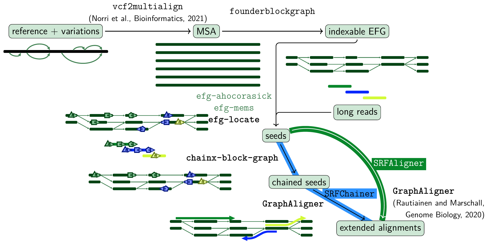

# seed-chain-extend on iEFGs
`SRFAligner` and `SRFChainer` are long-read aligners based on indexable Elastic Founder Graphs (iEFGs), which can be obtained from multiple sequence alignments using [`founderblockgraph`](https://github.com/algbio/founderblockgraphs) or from VCF files with the pipeline implemented in `experiments/vcf-to-hapl-to-efg`. The graphs used in the experiments can be found at [doi.org/10.5281/zenodo.14012881](https://doi.org/10.5281/zenodo.14012881).



## getting started
`SRFAligner` and `SRFChainer` are Bash programs based on [`efg-locate`](tools/efg-locate), [`chainx-block-graph`](tools/ChainX-block-graph) (from this repository, tested on GCC >= 15), and [`GraphAligner`](https://github.com/maickrau/GraphAligner) (>= 1.0.19). Clone this repository and compile `efg-locate` and `chainx-block-graph` with
```console
git clone https://github.com/algbio/SRFAligner && cd SRFAligner
git submodule update --init tools/{sdsl-lite-v3,concurrentqueue}
make
```
`GraphAligner`'s executable is expected to be found in `tools/GraphAligner/bin`, so you can run command `git submodule update --init --recursive tools/GraphAligner` and follow its [compilation instructions](https://github.com/maickrau/GraphAligner?tab=readme-ov-file#compilation), or if `GraphAligner` is already installed in your system, you can just modify the relative line in the appropriate programs with
```console
sed --in-place '7s/.*/graphaligner=GraphAligner/' SRFAligner SRFChainer efg-memsAligner efg-ahocorasickAligner
```
Finally, test your setup with
```console
./SRFAligner -g test/graph1.gfa -f test/read1.fastq -a test/aln1.gaf
./SRFChainer -g test/graph2.gfa -f test/read2.fastq -a test/aln2.gaf
```

## prototype aligners
As part of our experiments, we also developed two other interesting aligners: `efg-ahocorasickAligner` and `efg-memsAligner`.

### Full node seeds via the Aho-Corasick automaton
To use full node seeds computed by the Aho-Corasick automaton of the iEFG node labels (based on [`daachorse`](https://github.com/daac-tools/daachorse), requires Rust >= 1.61), `efg-ahocorasickAligner` depends on [`efg-ahocorasick`](tools/efg-ahocorasick) and [`efg-gaf-splitter`](tools/efg-gaf-splitter) (from this repository); [`seqtk`](https://github.com/lh3/seqtk) is expected to be in `tools/seqtk`. Compile all three with
```console
git submodule update --init --recursive {tools/daachorse,tools/seqtk}
make -C tools/seqtk
make -C tools/efg-ahocorasick
```

### Maximal exact match seeds
To use MEM seeds computed by [`efg-mems`](https://github.com/algbio/efg-mems), `efg-memsAligner` expects `efg-mems`'s executable to be in `tools/efg-mems/efg-mems` and [`seqtk`](https://github.com/lh3/seqtk) to be in `tools/seqtk`:
```console
git submodule update --init --recursive {tools/efg-mems,tools/seqtk}
make -C tools/seqtk
cd tools/efg-mems/sdsl-lite
./install.sh .
cd ..
cmake .
make
```

## publication
> Nicola Rizzo, Manuel Cáceres, Veli Mäkinen.
> [*Exploiting uniqueness: seed-chain-extend alignment on elastic founder graphs*](https://doi.org/10.1093/bioinformatics/btaf225).
> Bioinformatics, 2025.
